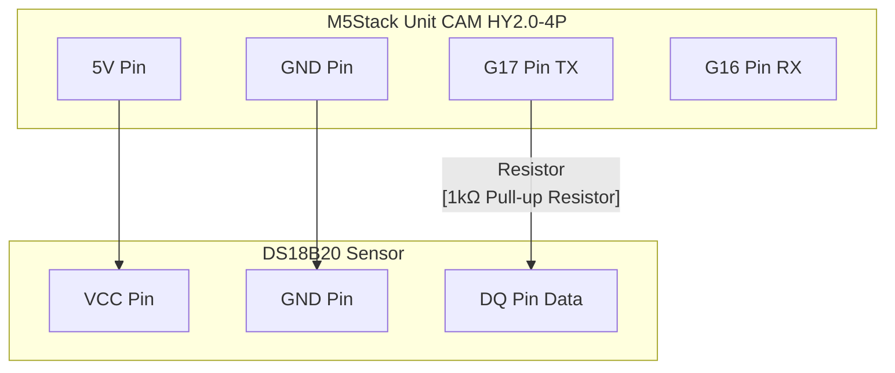

## 配線図

```mermaid
graph TD
    subgraph "M5Stack Unit CAM HY2.0-4P"
        UnitCAM_5V[5V Pin]
        UnitCAM_GND[GND Pin]
        UnitCAM_G17[G17 Pin TX]
        UnitCAM_G16[G16 Pin RX]
    end

    subgraph "DS18B20 Sensor"
        DS_VCC[VCC Pin]
        DS_GND[GND Pin]
        DS_DQ[DQ Pin Data]
    end

    UnitCAM_5V --> DS_VCC;
    UnitCAM_GND --> DS_GND;
    %% プルアップ抵抗の接続 VCCとDQの間
    UnitCAM_G17 -- Resistor<br>[1kΩ Pull-up Resistor]  --> DS_DQ;
```
