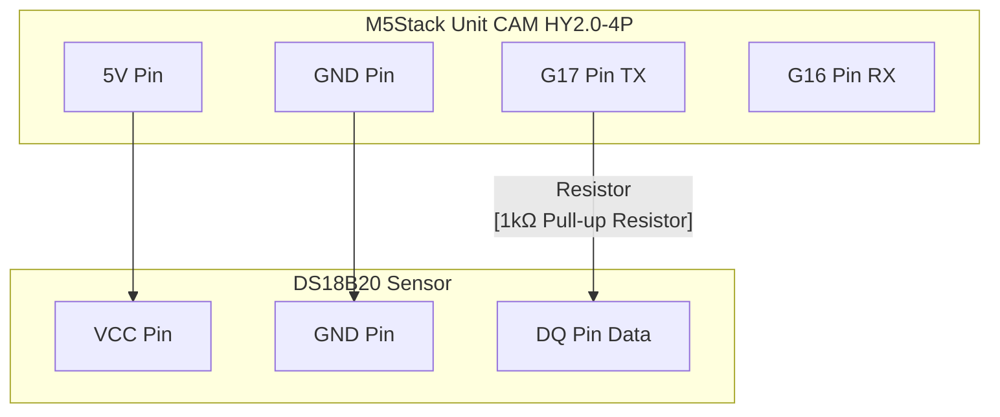

# ESP32 DS18B20 温度センサー (Rust, esp-idf-hal, RMT, Deep Sleep)

ESP32 と DS18B20 温度センサーを使用して、定期的に温度を測定し、ディープスリープで省電力化する Rust プロジェクトです。

## 特徴

*   Rust と `esp-idf-hal` を使用
*   `esp-idf-hal` の RMT ベース 1-Wire ドライバー (`OWDriver`) を利用
*   DS18B20 温度センサーから温度を取得
*   測定後にタイマーウェイクアップ付きのディープスリープに入り、低消費電力を実現

## 必要なもの

*   ESP32 開発ボード (このプロジェクトでは **M5Stack Unit CAM** を使用。ESP32-DevKitC など他のボードでも動作可能)
*   DS18B20 温度センサー
*   4.7kΩ 抵抗 (プルアップ用)
*   ジャンパワイヤ
*   Rust と ESP-IDF 開発環境 (espup を使用したセットアップ推奨)

## 配線図



*   **ONEWIRE_GPIO_PIN:** ESP32 の任意の GPIO ピン (コード内ではデフォルトで GPIO 17 を使用)。
*   **3.3V / GND:** ESP32 の電源ピンに接続。
*   **プルアップ抵抗:** 3.3V と ONEWIRE_GPIO_PIN の間に 4.7kΩ の抵抗を接続します。(注: 1kΩでも動作確認済みですが、一般的には4.7kΩが推奨されます。)

## セットアップ

1.  **リポジトリをクローン:**
    ```bash
    git clone <repository-url>
    cd temp_sensor
    ```

2.  **ESP-IDF コンポーネントの追加:**
    `Cargo.toml` に以下の設定が追加されていることを確認してください。これにより、`esp-idf-hal` の `OWDriver` が必要とする ESP-IDF の `onewire_bus` コンポーネントがビルド時に組み込まれます。
    ```toml
    # Cargo.toml
    [[package.metadata.esp-idf-sys.extra_components]]
    remote_component = { name = "onewire_bus", version = "^1.0.2" }
    ```

3.  **コードの確認:**
    `src/main.rs` 内の GPIO ピン番号 (`peripherals.pins.gpio17`) が、実際の配線と一致しているか確認してください。

## ビルドと書き込み

1.  **ビルド:**
    ```bash
    cargo build --release
    ```

2.  **書き込み & モニター:**
    ESP32 ボードを接続し、シリアルポートを確認して以下のコマンドを実行します (`/dev/tty.usbserial-XXXXXX` は実際のポート名に置き換えてください)。
    ```bash
    cargo espflash flash --release --port /dev/tty.usbserial-XXXXXX --monitor
    ```

    モニターには、デバイスの検索、温度の測定結果、そしてディープスリープに入る旨のログが表示され、約30秒後に ESP32 が再起動して同じプロセスを繰り返します。

## コードについて

*   `src/main.rs` に主要なロジックが含まれています。
*   `esp_idf_hal::onewire::OWDriver` を使用して 1-Wire バスを初期化します。
*   `OWDriver::search()` で接続されているデバイスを検索します。
*   ヘルパー関数 (`ds18b20_trigger_temp_conversion`, `ds18b20_get_temperature`) を使用して温度を取得します。
*   `esp_idf_sys` の関数 (`esp_sleep_enable_timer_wakeup`, `esp_deep_sleep_start`) を使用してディープスリープを実行します。

## トラブルシューティング

*   **デバイスが見つからない場合:**
    *   配線（VCC, GND, DQ）が正しいか確認してください。
    *   プルアップ抵抗 (4.7kΩ) が VCC と DQ の間に正しく接続されているか確認してください。
    *   `src/main.rs` で指定している GPIO ピン番号が配線と一致しているか確認してください。
    *   センサーの電源 (VCC) が安定して供給されているか確認してください (3.3V または 5V)。
*   **ビルドエラー:**
    *   Rust と ESP-IDF の開発環境が正しくセットアップされているか確認してください (`espup` 推奨)。
    *   `Cargo.toml` の依存関係や `extra_components` の設定が正しいか確認してください。
