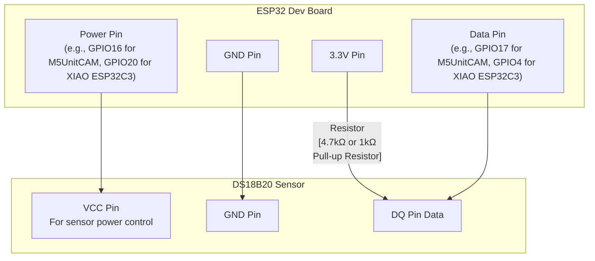

# ESP32 DS18B20 Temperature Sensor Library & Sample Applications (Rust, esp-idf-hal, RMT)

This is a Rust library for measuring temperature using an ESP32 and a DS18B20 temperature sensor, along with sample applications demonstrating its usage.

## Features

*   Uses Rust and `esp-idf-hal`.
*   Provides a library for obtaining temperature from a DS18B20 temperature sensor.
    *   Utilizes the RMT-based 1-Wire driver (`OWDriver`) from `esp-idf-hal`.
    *   Separates hardware-independent temperature conversion logic from hardware control logic for ESP32/Xtensa targets.
*   Includes sample applications in the `examples` directory to demonstrate library usage.
    *   `examples/m5unitcam_get_temperature`: Sample for M5Unit CAM (ESP32).
    *   `examples/xiao_esp32c3_get_temperature`: Sample for XIAO ESP32C3.

## Requirements

*   ESP32 development board (e.g., ESP32-DevKitC, any ESP32/Xtensa-based board).
*   DS18B20 temperature sensor.
*   4.7kΩ resistor (for pull-up). (A 1kΩ resistor may also work, depending on the circuit conditions.)
*   Jumper wires.
*   Rust and ESP-IDF development environment (setup using `espup` is recommended).

## Wiring Diagram



*   **Data Pin:** Any GPIO pin on the ESP32.
    *   `examples/m5unitcam_get_temperature` uses `GPIO17`.
    *   `examples/xiao_esp32c3_get_temperature` uses `GPIO4`.
*   **Power Pin:** Any GPIO pin on the ESP32. Controls the sensor's power.
    *   `examples/m5unitcam_get_temperature` uses `GPIO16`.
    *   `examples/xiao_esp32c3_get_temperature` uses `GPIO20`.
*   **3.3V / GND:** Connect to the ESP32's power pins.
*   **Pull-up Resistor:** Connect a 4.7kΩ resistor between the 3.3V and Data Pin. (Note: A 1kΩ resistor can sometimes be used as an alternative, but 4.7kΩ is generally recommended for stability.)

## Setup

1.  **Clone the repository:**
    ```bash
    git clone <repository-url>
    cd temp_sensor
    ```

2.  **Check ESP-IDF components:**
    Ensure that your `Cargo.toml` includes the following configuration. This ensures that the `onewire_bus` ESP-IDF component, required by `esp-idf-hal`'s `OWDriver`, is included during the build.
    ```toml
    # Cargo.toml (in the root project or each example project)
    [[package.metadata.esp-idf-sys.extra_components]]
    remote_component = { name = "onewire_bus", version = "^1.0.2" }
    ```

3.  **Verify pin settings (Sample Applications):**
    When using the sample applications (`examples/m5unitcam_get_temperature/src/main.rs` or `examples/xiao_esp32c3_get_temperature/src/main.rs`), make sure to specify the correct power pin and data pin numbers in the `TempSensor::new(POWER_PIN, DATA_PIN)` instantiation to match your actual wiring.
    *   M5Unit CAM sample: Default is `TempSensor::new(16, 17)?`
    *   XIAO ESP32C3 sample: Default is `TempSensor::new(20, 4)?`

## Build and Flash (Sample Applications)

Each sample application is built and flashed from within its respective directory.

### Example: `m5unitcam_get_temperature` Sample

1.  **Change directory:**
    ```bash
    cd examples/m5unitcam_get_temperature
    ```

2.  **Build:**
    ```bash
    cargo build --release
    ```

3.  **Flash & Monitor:**
    Connect your ESP32 board, identify the serial port, and run the following command (replace `/dev/tty.usbserial-XXXXXX` with your actual port name):
    ```bash
    cargo espflash flash --release --port /dev/tty.usbserial-XXXXXX --monitor
    ```
    The monitor will display the periodically measured temperature.

### Example: `xiao_esp32c3_get_temperature` Sample

1.  **Change directory:**
    ```bash
    cd examples/xiao_esp32c3_get_temperature
    ```

2.  **Build:**
    ```bash
    cargo build --release
    ```

3.  **Flash & Monitor:**
    Connect your ESP32C3 board, identify the serial port, and run the following command (replace `/dev/tty.usbserial-XXXXXX` with your actual port name):
    ```bash
    cargo espflash flash --release --port /dev/tty.usbserial-XXXXXX --monitor
    ```
    The monitor will display the periodically measured temperature.

## Testing

This project includes unit tests for the temperature conversion logic.
These tests are run on the native target of your development machine (e.g., PC or Mac), not on the ESP32 target.

### How to Run Tests

You can run the tests with the following command:

```bash
cargo test --lib --target <your-native-target>
```

Replace `<your-native-target>` with the native target of your development environment.
For example, `aarch64-apple-darwin` for Apple Silicon Macs, `x86_64-apple-darwin` for Intel Macs, or `x86_64-unknown-linux-gnu` for Linux.

### Notes

*   Tests only cover the hardware-independent logic part (`src/temp_sensor/logic.rs`).
*   ESP32/Xtensa-specific code (`src/temp_sensor/temp_sensor.rs`) is excluded from native target tests. This is because it's configured to compile only when the target architecture (`riscv32` or `xtensa`) is specified in `Cargo.toml` and the module structure (`src/temp_sensor/mod.rs`).

## About the Code

This project consists of a library crate (`simple_ds18b20_temp_sensor`) and a set of sample applications that use it (in the `examples` directory).

*   **`src/lib.rs`**:
    *   Entry point for the library crate.
    *   Exposes the `temp_sensor` module.
    *   Exports the `TempSensor` struct only for ESP32/Xtensa targets.

*   **`src/temp_sensor/mod.rs`**:
    *   Defines the `logic` module (hardware-independent logic).
    *   Defines and exports the `temp_sensor` module (hardware-dependent logic) and the `TempSensor` struct only for ESP32/Xtensa targets.

*   **`src/temp_sensor/logic.rs`**:
    *   Provides the `ds18b20_raw_to_celsius` function to convert raw data (LSB and MSB) from the DS18B20 sensor to Celsius temperature.
    *   Functions in this module are hardware-independent and can be unit-tested on a native target.

*   **`src/temp_sensor/temp_sensor.rs`**:
    *   Defines the `TempSensor` struct and provides functionality for initializing the DS18B20 sensor, searching for devices, and reading the temperature.
    *   Uses `esp-idf-hal`'s `PinDriver` to control the sensor's power and `OWDriver` (RMT-based 1-Wire driver) to communicate with the sensor.
    *   This module is specific to ESP32/Xtensa targets.

*   **`examples/`**:
    *   Contains sample applications that utilize the `TempSensor` from the library crate.
    *   **`m5unitcam_get_temperature/src/main.rs`**: A sample that measures temperature with an M5Unit CAM (ESP-WROOM-32E) and prints it to the console.
    *   **`xiao_esp32c3_get_temperature/src/main.rs`**: A sample that measures temperature with a XIAO ESP32C3 and prints it to the console.
    *   Each sample initializes `TempSensor` with specified GPIO pins and periodically reads and prints the temperature in a loop.

## Troubleshooting

*   **Device not found / Temperature not read correctly:**
    *   Verify that the wiring (sensor's VCC, GND, DQ, and pull-up resistor) is correct. Especially, ensure the pull-up resistor (typically 4.7kΩ, though 1kΩ might work in some cases) is correctly connected between the microcontroller's 3.3V power and the sensor's DQ (data line).
    *   Confirm that the GPIO pin numbers specified in `TempSensor::new(POWER_PIN, DATA_PIN)` within each sample application match your actual wiring.
    *   Ensure that the sensor's power (VCC) is stably supplied.
*   **Build errors:**
    *   Verify that your Rust and ESP-IDF development environment is set up correctly ( `espup` recommended).
    *   Check that the dependencies in `Cargo.toml` and `extra_components` settings are correct.
