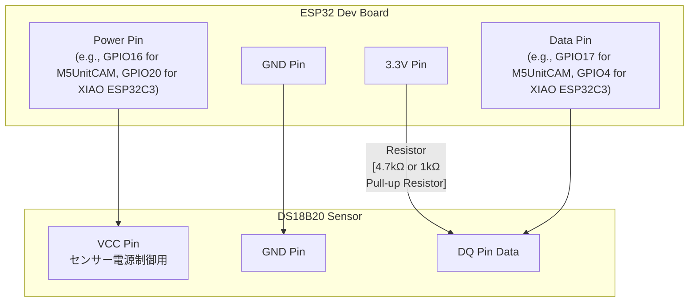

# ESP32 DS18B20 温度センサーライブラリ & サンプルアプリケーション (Rust, esp-idf-hal, RMT)

ESP32 と DS18B20 温度センサーを使用して温度を測定するための Rust ライブラリ、およびその使用方法を示すサンプルアプリケーションです。

## 特徴

*   Rust と `esp-idf-hal` を使用
*   DS18B20 温度センサーから温度を取得するためのライブラリを提供
    *   `esp-idf-hal` の RMT ベース 1-Wire ドライバー (`OWDriver`) を利用
    *   ハードウェア非依存の温度変換ロジックと、ESP32/Xtensa ターゲット向けのハードウェア制御ロジックを分離
*   ライブラリの使用方法を示すサンプルアプリケーションを `examples` ディレクトリに同梱
    *   `examples/m5unitcam_get_temperature`: M5Unit CAM (ESP32) 向けのサンプル
    *   `examples/xiao_esp32c3_get_temperature`: XIAO ESP32C3 向けのサンプル

## 必要なもの

*   ESP32 開発ボード (ESP32-DevKitC など、任意のESP32/Xtensaベースボード)
*   DS18B20 温度センサー
*   4.7kΩ 抵抗 (プルアップ用)。(回路条件によっては1kΩの抵抗も使用可能な場合があります)
*   ジャンパワイヤ
*   Rust と ESP-IDF 開発環境 (espup を使用したセットアップ推奨)

## 配線図



*   **Data Pin:** ESP32 の任意の GPIO ピン。
    *   `examples/m5unitcam_get_temperature` では `GPIO17` を使用。
    *   `examples/xiao_esp32c3_get_temperature` では `GPIO4` を使用。
*   **Power Pin:** ESP32 の任意の GPIO ピン。センサーの電源を制御します。
    *   `examples/m5unitcam_get_temperature` では `GPIO16` を使用。
    *   `examples/xiao_esp32c3_get_temperature` では `GPIO20` を使用。
*   **3.3V / GND:** ESP32 の電源ピンに接続。
*   **プルアップ抵抗:** 3.3V と Data Pin の間に 4.7kΩ の抵抗を接続します。(参考: 1kΩの抵抗も代替として使用できる場合がありますが、一般的には安定性のため4.7kΩが推奨されます)

## セットアップ

1.  **リポジトリをクローン:**
    ```bash
    git clone <repository-url>
    cd temp_sensor
    ```

2.  **ESP-IDF コンポーネントの確認:**
    `Cargo.toml` に以下の設定が含まれていることを確認してください。これにより、`esp-idf-hal` の `OWDriver` が必要とする ESP-IDF の `onewire_bus` コンポーネントがビルド時に組み込まれます。
    ```toml
    # Cargo.toml (ルートプロジェクトまたは各exampleプロジェクト内)
    [[package.metadata.esp-idf-sys.extra_components]]
    remote_component = { name = "onewire_bus", version = "^1.0.2" }
    ```

3.  **ピン設定の確認 (サンプルアプリケーション):**
    各サンプルアプリケーション (`examples/m5unitcam_get_temperature/src/main.rs` または `examples/xiao_esp32c3_get_temperature/src/main.rs`) を使用する場合、`TempSensor::new(POWER_PIN, DATA_PIN)` のようにインスタンスを作成している箇所で、実際の配線に合わせて電源ピン番号とデータピン番号を指定してください。
    *   M5Unit CAM サンプル: デフォルトは `TempSensor::new(16, 17)?`
    *   XIAO ESP32C3 サンプル: デフォルトは `TempSensor::new(20, 4)?`

## ビルドと書き込み (サンプルアプリケーション)

各サンプルアプリケーションは、それぞれのディレクトリ内でビルドおよび書き込みを行います。

### 例: `m5unitcam_get_temperature` サンプルの場合

1.  **ディレクトリ移動:**
    ```bash
    cd examples/m5unitcam_get_temperature
    ```

2.  **ビルド:**
    ```bash
    cargo build --release
    ```

3.  **書き込み & モニター:**
    ESP32 ボードを接続し、シリアルポートを確認して以下のコマンドを実行します (`/dev/tty.usbserial-XXXXXX` は実際のポート名に置き換えてください)。
    ```bash
    cargo espflash flash --release --port /dev/tty.usbserial-XXXXXX --monitor
    ```

    モニターには、定期的に測定された温度が表示されます。

### 例: `xiao_esp32c3_get_temperature` サンプルの場合

1.  **ディレクトリ移動:**
    ```bash
    cd examples/xiao_esp32c3_get_temperature
    ```

2.  **ビルド:**
    ```bash
    cargo build --release
    ```

3.  **書き込み & モニター:**
    ESP32C3 ボードを接続し、シリアルポートを確認して以下のコマンドを実行します (`/dev/tty.usbserial-XXXXXX` は実際のポート名に置き換えてください)。
    ```bash
    cargo espflash flash --release --port /dev/tty.usbserial-XXXXXX --monitor
    ```

    モニターには、定期的に測定された温度が表示されます。

## テスト

このプロジェクトには、温度変換ロジックのユニットテストが含まれています。
これらのテストは、ESP32ターゲットではなく、開発マシン（例: PCやMac）のネイティブターゲットで実行されます。

### テストの実行方法

以下のコマンドでテストを実行できます。

```bash
cargo test --lib --target <your-native-target>
```

`<your-native-target>` は、お使いの開発環境のネイティブターゲットに置き換えてください。
例えば、Apple Silicon Macの場合は `aarch64-apple-darwin`、Intel Macの場合は `x86_64-apple-darwin`、Linuxの場合は `x86_64-unknown-linux-gnu` などになります。

### 注意点

*   テストは、ハードウェアに依存しないロジック部分 (`src/temp_sensor/logic.rs`) のみを対象としています。
*   ESP32/Xtensa固有のコード (`src/temp_sensor/temp_sensor.rs`) は、ネイティブターゲットでのテストからは除外されます。これは、`Cargo.toml` およびモジュール構造 (`src/temp_sensor/mod.rs`) でターゲットアーキテクチャ (`riscv32` または `xtensa`) が指定されている場合にのみコンパイルされるように設定されているためです。

## コードについて

このプロジェクトは、ライブラリクレート (`simple_ds18b20_temp_sensor`) と、それを利用するサンプルアプリケーション群 (`examples` ディレクトリ) で構成されています。

*   **`src/lib.rs`**:
    *   ライブラリクレートのエントリーポイントです。
    *   `temp_sensor` モジュールを公開します。
    *   ESP32/Xtensa ターゲットの場合のみ `TempSensor` 構造体をエクスポートします。

*   **`src/temp_sensor/mod.rs`**:
    *   `logic` モジュール（ハードウェア非依存のロジック）を定義します。
    *   ESP32/Xtensa ターゲットの場合のみ、`temp_sensor` モジュール（ハードウェア依存のロジック）と `TempSensor` 構造体を定義・エクスポートします。

*   **`src/temp_sensor/logic.rs`**:
    *   DS18B20センサーの生データ（LSBとMSB）を摂氏温度に変換する関数 `ds18b20_raw_to_celsius` を提供します。
    *   このモジュールの関数はハードウェアに依存せず、ネイティブターゲットでのユニットテストが可能です。

*   **`src/temp_sensor/temp_sensor.rs`**:
    *   `TempSensor` 構造体を定義し、DS18B20センサーの初期化、デバイス検索、温度読み取りの機能を提供します。
    *   `esp-idf-hal` の `PinDriver` を使用してセンサーの電源を制御し、`OWDriver` (RMTベースの1-Wireドライバ) を使用してセンサーと通信します。
    *   このモジュールは ESP32/Xtensa ターゲット専用です。

*   **`examples/`**:\
    *   ライブラリクレートの `TempSensor` を利用するサンプルアプリケーションが格納されています。
    *   **`m5unitcam_get_temperature/src/main.rs`**: M5Unit CAM (ESP-WROOM-32E) で温度を測定し、コンソールに出力するサンプルです。
    *   **`xiao_esp32c3_get_temperature/src/main.rs`**: XIAO ESP32C3 で温度を測定し、コンソールに出力するサンプルです。
    *   各サンプルは、指定されたGPIOピンで `TempSensor` を初期化し、ループ内で定期的に温度を読み取ってコンソールに出力します。

## トラブルシューティング

*   **デバイスが見つからない場合 / 温度が正しく読み取れない場合:**
    *   配線（センサーのVCC, GND, DQ、およびプルアップ抵抗）が正しいか確認してください。特に、プルアップ抵抗 (通常4.7kΩですが、場合によっては1kΩでも動作します) がマイコンの3.3V電源とセンサーのDQ（データ線）の間に正しく接続されているか確認してください。
    *   各サンプルアプリケーション内の `TempSensor::new(POWER_PIN, DATA_PIN)` で指定しているGPIOピン番号が、実際の配線と一致しているか確認してください。
    *   センサーの電源 (VCC) が安定して供給されているか確認してください。
*   **ビルドエラー:**
    *   Rust と ESP-IDF の開発環境が正しくセットアップされているか確認してください (`espup` 推奨)。
    *   `Cargo.toml` の依存関係や `extra_components` の設定が正しいか確認してください。
